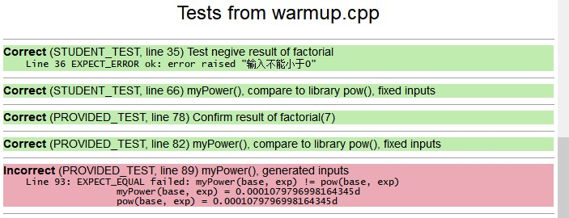
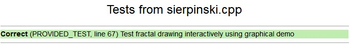
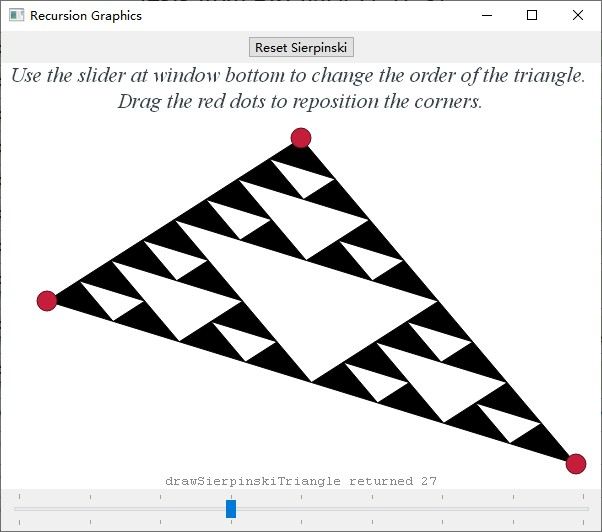
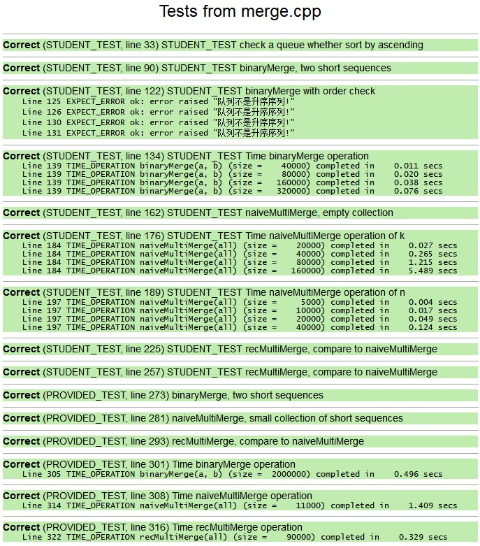
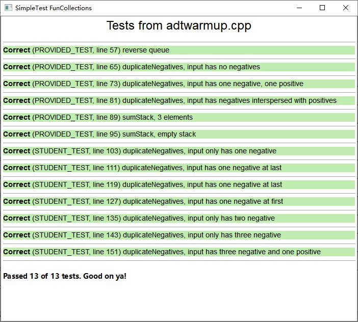
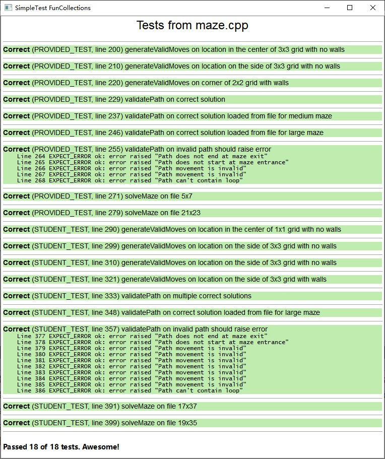
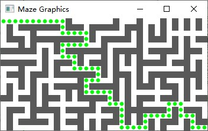
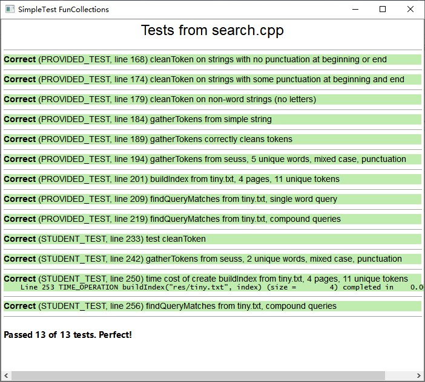
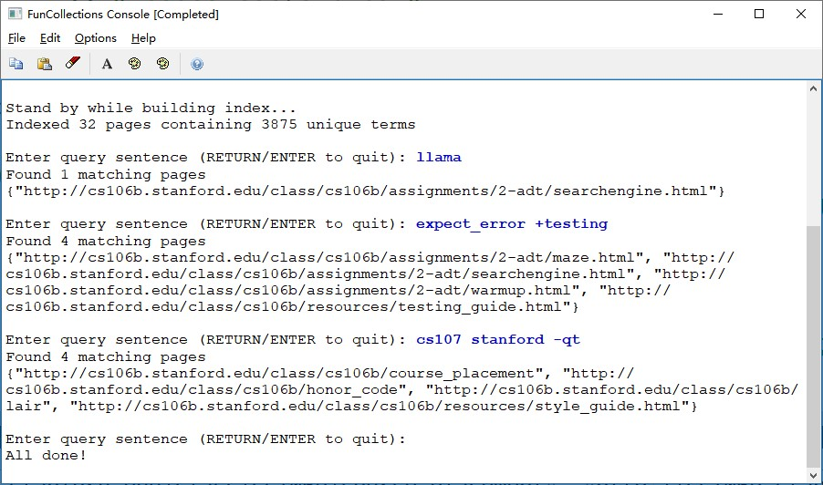

[TOC]

# Assign-3

### HW1

##### Test-result

### HW2

##### Test-result

### HW3

##### Test-result

##### Final-result

### HW4

##### Test-result

# Assign-2

### HW1

##### Test-result

### HW2

##### Test-result

##### Final-result

### HW3

##### Test-result

##### Final-result

# Assign-1

### HW1

##### Test-result

### HW2

##### Test-result

##### Final-result

# lec4-String-palindrome

# lec1-Introduction-print-star-v2

# Assign-0

E1:

E2:

